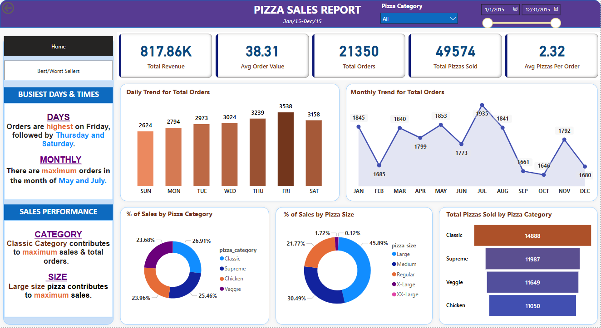
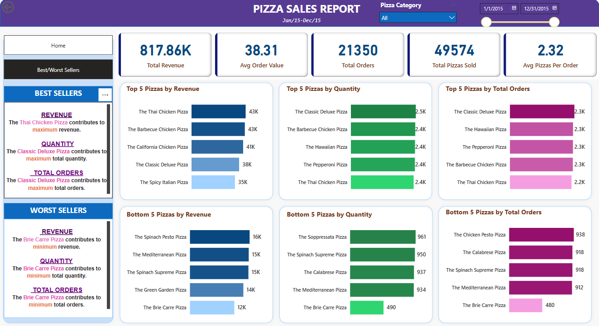

# Pizza Sales Insights Dashboard (Power BI + MySQL)

A detailed analysis of pizza sales using **Power BI dashboards** backed by **MySQL data validation**. It visualizes key performance metrics, sales patterns and top/bottom performers across pizza types, categories and sizes.

## Sample Screenshots

### Sales Summary

### Best/Worst Sellers

## Dashboards Overview

### **Sales_Trend Dashboard**
- Total revenue, total orders and pizzas sold
- Daily and monthly order trends
- Sales % by pizza category and size
- Peak order days and months
- Performance by pizza category and size

### **Best_Worst_Analysis Dashboard**
- Top 5 pizzas by:
  - Revenue
  - Quantity sold
  - Total orders
- Bottom 5 pizzas by the same KPIs
- Clear segmentation of high and low performers

## Tech Stack
- **Power BI**: Data visualization and dashboard development
- **MySQL**: Backend database for querying and validation
- **Excel** (optional): Initial data preparation

## Files Included
- `Sales_Trend.png`: Sales Summary Dashboard
- `Best_Worst_Analysis.png`: Best/Worst Sellers Dashboard
- `.xlsx` file: Excel file of Dataset
- `.sql` script: MySQL queries used for validation
